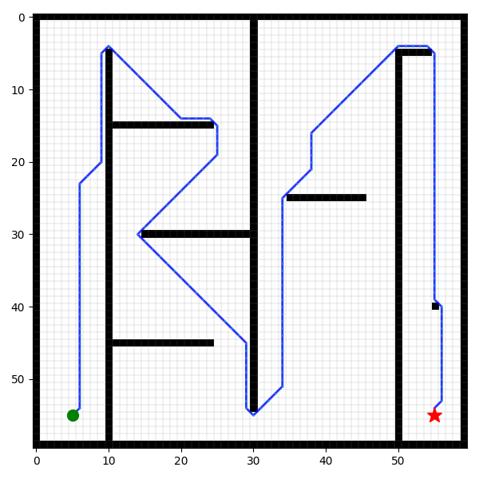
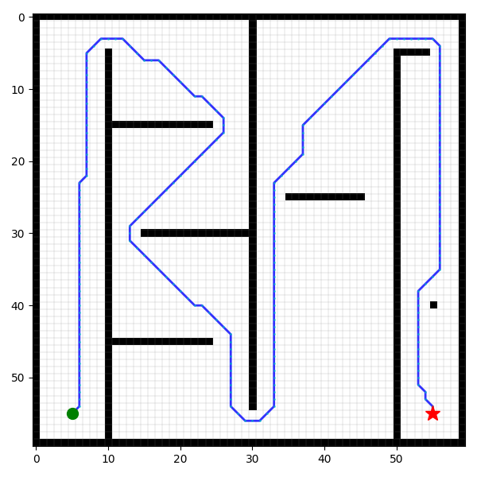
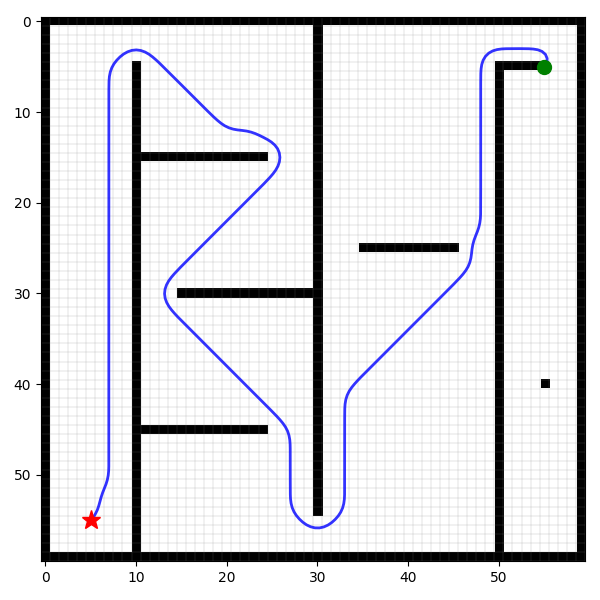
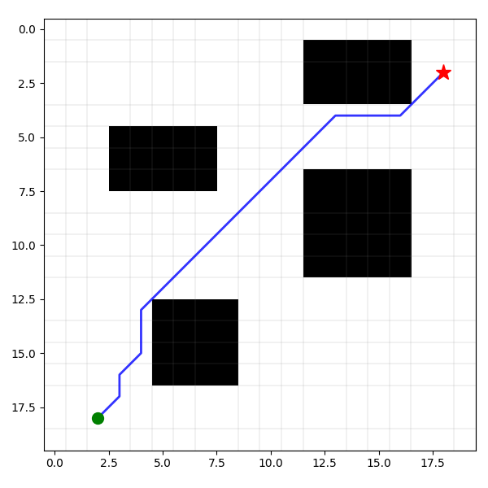
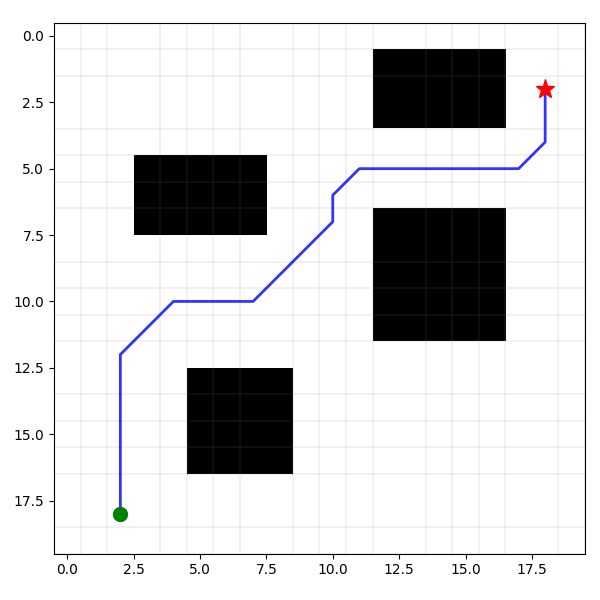
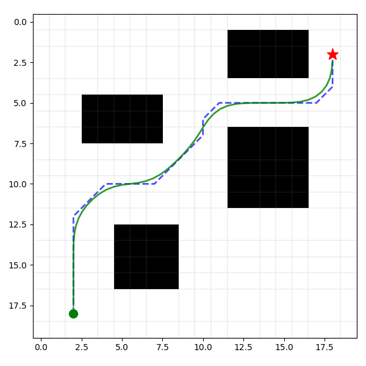

# Astar-MPC

基于 **A\*** 与 **MPC** 的路径规划项目：A\* 负责全局路径规划，MPC 负责局部路径规划。

## 概述

- **A\***：在已知栅格地图上搜索从起点到终点的全局最优/可行路径，得到一条粗粒度参考轨迹。
- **MPC（模型预测控制）**：在全局路径附近进行局部轨迹优化，考虑动力学约束与障碍物，实现平滑、可跟踪的局部路径。

## 轨迹平滑
从“几何路径”向“时空轨迹（Trajectory）”转换的过程。
A* 产生的通常是一系列离散的网格点，由于它不考虑车辆动力学，路径往往存在折线、不平滑以及缺乏速度信息等问题。
全局路径规划的航路点作为MPC的输入，需要将全局航路点转化成MPC的参考轨迹

| 步骤 | 输出内容 | 目的 |
| --- | --- | --- |
| A* | 离散格点序列 | 确定全局通过性 |
| 平滑 | 连续曲线函数 | 符合车辆动力学约束 |
| 速度规划 | s−t 映射关系 | 确定每个点“何时”到达 |
| MPC 提取 | 长度为 N 的矩阵 | 给控制器提供滚动优化的目标 |


## 效果对比

<div align="center">

| 传统Astar | 改进Astar | 轨迹平滑 |
|:---:|:---:|:---:|
|  |  |  |
|  |  |  |

</div>

## 项目结构

```
Astar-MPC/
├── main.py                    # 程序入口
├── README.md                   # 项目说明文档
├── astar_mpc.docx              # 项目文档
├── env/                        # 环境配置
│   ├── map_1.py                # 栅格地图:500*500
│   └── map_2.py                # 栅格地图:60*60
├── astar/                      # A*算法模块
│   ├── __init__.py
│   ├── astar_planner.py       # 传统A*算法
│   ├── improverd_astar.py     # 改进A*算法
│   └── README.md
├── mpc/                        # MPC控制器模块
│   ├── __init__.py
│   └── mpc_controller.py       # MPC控制器
├── plt/                        # 绘图与可视化模块
│   ├── __init__.py
│   └── plot_map_path.py       # 路径可视化
├── media/                      # 媒体资源
│   ├── 传统Astar.png
│   ├── 传统astar_2.png
│   ├── 改进Astar.png
│   ├── 改进astar_2.png
│   ├── 平滑轨迹.png
│   └── 平滑轨迹_2.png
└── paper_ref/                  # 参考文献
```

### 参考资料

- [A*算法（A-star Algorithm）详解：理论与实例](https://zhuanlan.zhihu.com/p/590786438)
- [路径规划之 A* 算法](https://zhuanlan.zhihu.com/p/54510444)
- [基于改进A星算法融合改进动态窗口法的无人机动态避障方法研究_朱亚凯.pdf](paper_ref/基于改进A星算法融合改进动态窗口法的无人机动态避障方法研究_朱亚凯.pdf)